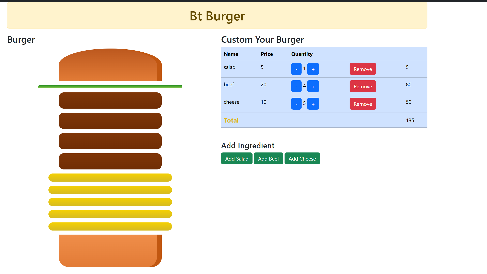
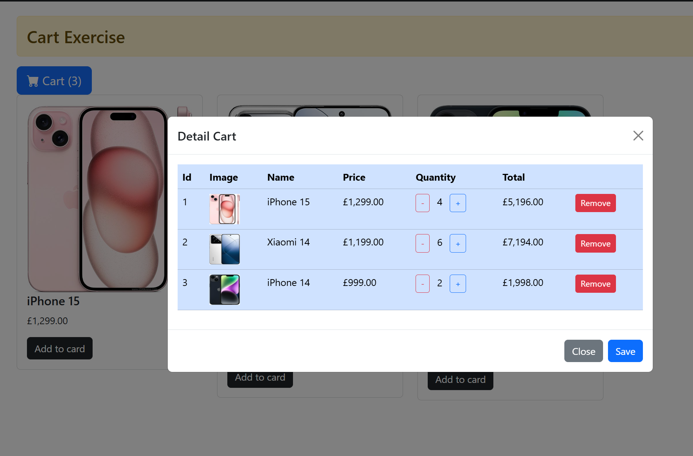

# 🚀 BootCamp .NET Journey

---

## 📌 About This Repository

This repository contains my practice exercises during the .NET Bootcamp program.  
Each folder represents exercises completed in a specific session.

---

## 📂 Project Structure

### 🔹 BT_Buoi01  
**Basic C# syntax, variables, data types**

### 🔹 BT_Buoi02  
**Loops and conditional statements**

### 🔹 BT_Buoi04  
**Functions (Methods) in C# – parameter passing, return values, and modular programming**

### 🔹 BT_Buoi05  
**Working with collection types (arrays, dictionaries) and basic algorithm problems**

### 🔹 BT_Buoi13  
**Object-Oriented Programming in C# – inheritance, polymorphism, abstract classes**

- Product management system  
- Add / delete products  
- Calculate expected revenue  

### 🔹 BT_Buoi21  
**Blazor Web Application – Resume (CV Online)**

- Sidebar navigation  
- Component-based structure  
- Data binding in Blazor  
- Responsive layout  

### 🔹 BT_Buoi22  
**Blazor – Car Exercise (State & UI Interaction)**

- Change car image based on selected color  
- Handle state with C# variables  
- Dynamic UI update (re-render)  
- Conditional styling for active button  

### 🔹 BT_Buoi23  
**Blazor – Form & Validation**

- Build Customer Contact Form and Course Registration Form  
- Apply two-way data binding with `@bind`  
- Use `EditForm` with `DataAnnotationsValidator`  
- Implement validation using DataAnnotations (`Required`, `EmailAddress`, `MinLength`, `RegularExpression`)  
- Handle various input types (text, textarea, select, radio, checkbox, date)  
- Configure routing for multiple pages  
- Create navigation menu (NavMenu) for page navigation  

### 🔹 BT_Buoi24
Blazor – Wallet Application (State & Component Communication)

- Build a simple wallet application with deposit and withdraw features
- Manage state (balance, transactions) in parent component
- Use component communication (EventCallback) between parent and child
- Implement modal popup for user input
- Handle validation (positive amount, withdraw not exceeding balance)
- Update UI dynamically after each transaction (re-render)
- Display transaction history with type, amount, and timestamp

### 🔹 BT_Buoi27

Blazor – State Management (Service & Shared State)

Implement state management using Service (Singleton/Scoped)
Use event callback (Action OnChange) to notify UI updates
Share data between multiple components
📌 Exercises:

1. Change Color Car

Change car image dynamically based on selected color
Manage UI state with shared service
Highlight selected color button

2. Shopping Cart

Add / remove products in cart
Update quantity and calculate total price
Sync data between components using shared state

3. Burger Builder

Customize burger ingredients (salad, beef, cheese, etc.)
Increase / decrease quantity of each ingredient
Render burger UI dynamically based on state
Calculate total price in real-time

## 📸 Demo

## 🍔 Burger Builder

## 🛒 Shopping Cart

## 🚗 Change Color Car
.png)

---

## 🎯 Learning Goals

- ✅ Practice C# fundamentals  
- ✅ Understand OOP concepts  
- ✅ Improve problem-solving skills  
- ✅ Write clean and modular code  
- ✅ Prepare for backend development  
- ✅ Work with collection types (Array, List, Dictionary)  
- ✅ Build UI using Blazor  
- ✅ Understand component-based architecture  

---

## ▶ How to Run

- Clone the repository  
- Open the solution file in Visual Studio  
- Build and run the project using **F5** (with debugging) or **Ctrl + F5** (without debugging)

### 💻 Requirements
- .NET 6.0 SDK or later  
- Visual Studio 2022 (recommended)

---

## 🛠 Technologies Used

- C#  
- .NET  
- Blazor  
- HTML / CSS  
- Git & GitHub  

---

## 📬 Contact

Connect with me via:  
**khanhvy0946265560@gmail.com**

---

© 2026 khanhvy0908